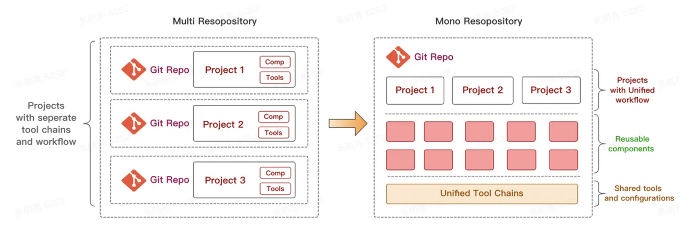

## 项目结构

## 项目工程化配置

### 代码仓库管理策略

使用**monorepo**策略进行管理，相应的技术采用**pnpn workspace**，这么做的好处是统一开发、打包以及发布规范，方便协同管理不同库的生命周期。同时所有的依赖都全局进行管理，而包与包之间的依赖则通过软链接进行组织，减少了由于依赖复制带来的磁盘负荷。

### 代码规范及风格

用**eslint**进行代码语法检查，代码风格的检查则交给**prettier**，这里需要注意的是，eslint自带有代码风格的检查，为防止冲突，需要将prettier集成到eslint的配置中。

### commit规范

用**husky**拦截每一次commit提交，并在提交前执行`pnpm lint`，用以检查代码是否符合规范。另外，使用**commitlint**对commit的信息进行规范检查。

### 打包工具

**rollup**(https://bundlers.tooling.report/) 默认支持原生ESM格式
